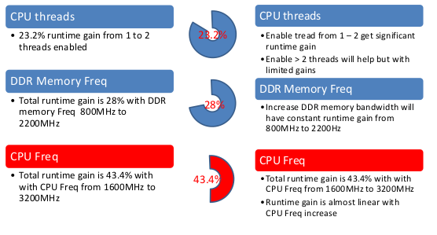

# Vivado Runtime Benchmark 

You may also wonder which PC/Server configuration could provide the best performance for Vivado runtime. Since the merdon FPGA designs are becoming bigger and bigger, it will take long time to run through the R&D process. The best way is to do the benchmark with same design to see which server configuration could get better results. But it might be not possible to give it a try before purchasing one. So, we may need few pointers before purchasing. 

The quick summary is as following:

